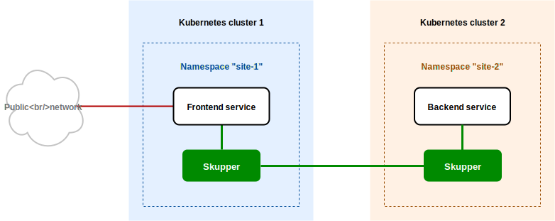

# Skupper Hello World with YAML

#### A minimal HTTP application deployed across Kubernetes clusters using Skupper

This example is part of a [suite of examples][examples] showing the
different ways you can use [Skupper][website] to connect services
across cloud providers, data centers, and edge sites.

[website]: https://skupper.io/
[examples]: https://skupper.io/examples/index.html

#### Contents

* [Overview](#overview)
* [Prerequisites](#prerequisites)
* [Step 1: Configure separate console sessions](#step-1-configure-separate-console-sessions)
* [Step 2: Access your clusters](#step-2-access-your-clusters)
* [Step 3: Set up your namespaces](#step-3-set-up-your-namespaces)
* [Step 4: Install Skupper in your namespaces](#step-4-install-skupper-in-your-namespaces)
* [Step 5: Apply your YAML resources](#step-5-apply-your-yaml-resources)
* [Step 6: Link your namespaces](#step-6-link-your-namespaces)
* [Step 7: Test the application](#step-7-test-the-application)
* [Cleaning up](#cleaning-up)
* [About this example](#about-this-example)

## Overview

This example is a variant of [Skupper Hello World][hello-world] that
is deployed using YAML resource definitions instead of imperative
commands.

It contains two services:

* A backend service that exposes an `/api/hello` endpoint.  It
  returns greetings of the form `Hi, <your-name>.  I am <my-name>
  (<pod-name>)`.

* A frontend service that sends greetings to the backend and
  fetches new greetings in response.

Skupper enables you place the backend in one cluster and the
frontend in another and maintain connectivity between the two
services without exposing the backend to the public internet.

[hello-world]: https://github.com/skupperproject/skupper-example-hello-world

## Prerequisites

* The `kubectl` command-line tool, version 1.15 or later
  ([installation guide][install-kubectl])

* Access to at least one Kubernetes cluster, from [any provider you
  choose][kube-providers]

[install-kubectl]: https://kubernetes.io/docs/tasks/tools/install-kubectl/
[kube-providers]: https://skupper.io/start/kubernetes.html

## Step 1: Configure separate console sessions

Skupper is designed for use with multiple namespaces, usually on
different clusters.  The `skupper` and `kubectl` commands use your
[kubeconfig][kubeconfig] and current context to select the
namespace where they operate.

[kubeconfig]: https://kubernetes.io/docs/concepts/configuration/organize-cluster-access-kubeconfig/

Your kubeconfig is stored in a file in your home directory.  The
`skupper` and `kubectl` commands use the `KUBECONFIG` environment
variable to locate it.

A single kubeconfig supports only one active context per user.
Since you will be using multiple contexts at once in this
exercise, you need to create distinct kubeconfigs.

Start a console session for each of your namespaces.  Set the
`KUBECONFIG` environment variable to a different path in each
session.

_**Console for site 1:**_

~~~ shell
export KUBECONFIG=~/.kube/config-site-1
~~~

_**Console for site 2:**_

~~~ shell
export KUBECONFIG=~/.kube/config-site-2
~~~

## Step 2: Access your clusters

The procedure for accessing a Kubernetes cluster varies by
provider. [Find the instructions for your chosen
provider][kube-providers] and use them to authenticate and
configure access for each console session.

[kube-providers]: https://skupper.io/start/kubernetes.html

## Step 3: Set up your namespaces

Use `kubectl create namespace` to create the namespaces you wish
to use (or use existing namespaces).  Use `kubectl config
set-context` to set the current namespace for each session.

_**Console for site 1:**_

~~~ shell
kubectl create namespace site-1
kubectl config set-context --current --namespace site-1
~~~

_**Console for site 2:**_

~~~ shell
kubectl create namespace site-2
kubectl config set-context --current --namespace site-2
~~~

## Step 4: Install Skupper in your namespaces

Use the `kubectl apply` command to install the Skupper router
and controller in each namespace.

**Note:** If you are using Minikube, [you need to start `minikube
tunnel`][minikube-tunnel] before you install Skupper.

[minikube-tunnel]: https://skupper.io/start/minikube.html#running-minikube-tunnel

_**Console for site 1:**_

~~~ shell
kubectl apply -f skupper.yaml
~~~

_**Console for site 2:**_

~~~ shell
kubectl apply -f skupper.yaml
~~~

## Step 5: Apply your YAML resources

To configure our example sites and service bindings, we are
using the following resources:

Site 1:

* [site.yaml](site-1/site.yaml) - Skupper configuration for site 1
* [frontend.yaml](site-1/frontend.yaml) - The Hello World frontend

Site 2:

* [site.yaml](site-2/site.yaml) - Skupper configuration for site 2
* [backend.yaml](site-2/backend.yaml) - The Hello World backend

Let's look at some of these resources in more detail.

#### Resources in site 1

The `site` ConfigMap defines a Skupper site for its associated
Kubernetes namespace.  This is where you set site configuration
options.  We are setting the `console` and `flow-collector`
options here in order to enable the console.  See the [config
reference][config] for more information.

[config]: https://skupper.io/docs/declarative/index.html

[site.yaml](site-1/site.yaml):

~~~ yaml
apiVersion: v1
kind: ConfigMap
metadata:
  name: skupper-site
data:
  name: site-1
  console: "true"
  flow-collector: "true"
~~~

#### Resources in site 2

Like the one for site 1, here is the Skupper site definition for
the site 2.  It includes the `ingress: "false"` setting since no
ingress is required at this site for the Hello World example.

[site.yaml](site-2/site.yaml):

~~~ yaml
apiVersion: v1
kind: ConfigMap
metadata:
  name: skupper-site
data:
  name: site-2
  ingress: "false"
~~~

In site 2, the `backend` deployment has an annotation named
`skupper.io/proxy` with the value `tcp`.  This tells Skupper to
expose the backend on the Skupper network.  As a consequence,
the frontend in site 1 will be able to see the backend and call
its API.

[backend.yaml](site-2/backend.yaml):

<pre>apiVersion: apps/v1
kind: Deployment
metadata:
  name: backend
  labels:
    app: backend
  <b>annotations:
    skupper.io/proxy: tcp</b>
spec:
  selector:
    matchLabels:
      app: backend
  replicas: 3
  template:
    metadata:
      labels:
        app: backend
    spec:
      containers:
        - name: backend
          image: quay.io/skupper/hello-world-backend
          ports:
            - containerPort: 8080</pre>

Now we're ready to apply everything.  Use the `kubectl apply`
command with the resource definitions for each site.

_**Console for site 1:**_

~~~ shell
kubectl apply -f site-1/site.yaml -f site-1/frontend.yaml
~~~

_Sample output:_

~~~ console
$ kubectl apply -f site-1/site.yaml -f site-1/frontend.yaml
configmap/skupper-site created
deployment.apps/frontend created
service/frontend created
~~~

_**Console for site 2:**_

~~~ shell
kubectl apply -f site-2/site.yaml -f site-2/backend.yaml
~~~

_Sample output:_

~~~ console
$ kubectl apply -f site-2/site.yaml -f site-2/backend.yaml
configmap/skupper-site created
deployment.apps/backend created
~~~

## Step 6: Link your namespaces

You can configure sites and service bindings declaratively, but
linking sites is different.  To create a link, you must have the
authentication secret and connection details of the remote site.
Since these cannot be known in advance, linking must be
procedural.

**Note:** There are several ways to automate the generation and
distribution of tokens across sites, using for example Ansible,
Backstage, or Vault.  See [Token distribution]() for more
information.

This example uses the Skupper command line tool to generate the
secret token in site 1 and create the link in site 2.

To install the Skupper command:

~~~ shell
curl https://skupper.io/install.sh | sh
~~~

For more installation options, see [Installing
Skupper][install].

Once the command is installed, use `skupper token create` in
site 1 to generate the token.  Then, use `skupper link create` in
site 2 to create a link.

[install]: https://skupper.io/install/index.html

_**Console for site 1:**_

~~~ shell
skupper token create ~/secret.token
~~~

_Sample output:_

~~~ console
$ skupper token create ~/secret.token
Token written to ~/secret.token
~~~

_**Console for site 2:**_

~~~ shell
skupper link create ~/secret.token
~~~

_Sample output:_

~~~ console
$ skupper link create ~/secret.token
Site configured to link to https://10.105.193.154:8081/ed9c37f6-d78a-11ec-a8c7-04421a4c5042 (name=link1)
Check the status of the link using 'skupper link status'.
~~~

If your console sessions are on different machines, you may need
to use `sftp` or a similar tool to transfer the token securely.
By default, tokens expire after a single use or 15 minutes after
creation.

## Step 7: Test the application

Now we're ready to try it out.  Use `kubectl get service/frontend`
to look up the external IP of the frontend service.  Then use
`curl` or a similar tool to request the `/api/health` endpoint at
that address.

**Note:** The `<external-ip>` field in the following commands is a
placeholder.  The actual value is an IP address.

_**Console for site 1:**_

~~~ shell
kubectl get service/frontend
curl http://<external-ip>:8080/api/health
~~~

_Sample output:_

~~~ console
$ kubectl get service/frontend
NAME       TYPE           CLUSTER-IP      EXTERNAL-IP     PORT(S)          AGE
frontend   LoadBalancer   10.103.232.28   <external-ip>   8080:30407/TCP   15s

$ curl http://<external-ip>:8080/api/health
OK
~~~

If everything is in order, you can now access the web interface by
navigating to `http://<external-ip>:8080/` in your browser.

## Cleaning up

To remove Skupper and the other resources from this exercise, use
the following commands.

_**Console for site 1:**_

~~~ shell
kubectl delete -f site-1/site.yaml -f site-1/frontend.yaml
kubectl delete -f skupper.yaml
~~~

_**Console for site 2:**_

~~~ shell
kubectl delete -f site-2/site.yaml -f site-2/backend.yaml
kubectl delete -f skupper.yaml
~~~

## Next steps

Check out the other [examples][examples] on the Skupper website.

## About this example

This example was produced using [Skewer][skewer], a library for
documenting and testing Skupper examples.

[skewer]: https://github.com/skupperproject/skewer

Skewer provides utility functions for generating the README and
running the example steps.  Use the `./plano` command in the project
root to see what is available.

To quickly stand up the example using Minikube, try the `./plano demo`
command.
